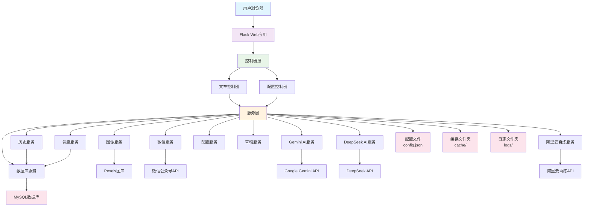

# MySQL数据库集成实现总结

## 概述

本项目已成功集成MySQL数据库支持，用于存储文章生成历史、发布历史和定时任务信息，以替代原有的JSON文件存储方式。此改进提供了更好的数据持久性、查询性能和扩展性。

## 实现的功能

### 1. 数据库服务模块 (DatabaseService)
- **文件**: `services/database_service.py`
- **功能**:
  - MySQL数据库连接管理
  - 数据表创建和维护
  - 文章历史记录的增删改查操作
  - 发布历史记录的增删改查操作
  - 定时任务记录的增删改查操作

### 2. 历史服务模块增强 (HistoryService)
- **文件**: `services/history_service.py`
- **功能**:
  - 集成DatabaseService进行数据操作
  - 保持与原有文件存储方式的兼容性
  - 提供统一的接口供其他模块调用

### 3. 调度服务模块增强 (SchedulerService)
- **文件**: `services/scheduler_service.py`
- **功能**:
  - 定时任务信息持久化到数据库
  - 系统启动时从数据库恢复未完成的定时任务

### 4. 配置服务模块增强 (ConfigService)
- **文件**: `services/config_service.py`
- **功能**:
  - 添加数据库配置项管理
  - 提供数据库配置状态检查

### 5. 主应用文件更新 (app_new.py)
- **文件**: `app_new.py`
- **功能**:
  - 应用启动时初始化数据库连接
  - 创建必要的数据表

## 数据库表结构

### 1. 文章历史表 (article_history)
```sql
CREATE TABLE article_history (
    id VARCHAR(50) PRIMARY KEY,
    title VARCHAR(255) NOT NULL,
    content_length INT DEFAULT 0,
    image_count INT DEFAULT 0,
    generated_at DATETIME,
    author VARCHAR(100),
    digest TEXT,
    content_source_url VARCHAR(500),
    status VARCHAR(20) DEFAULT 'generated',
    media_id VARCHAR(100),
    publish_id VARCHAR(100),
    msg_data_id VARCHAR(100),
    publish_time DATETIME NULL,
    published_at DATETIME NULL,
    saved_at DATETIME NULL,
    mass_sent BOOLEAN DEFAULT FALSE,
    mass_msg_id VARCHAR(100),
    mass_sent_at DATETIME NULL,
    enable_mass_send BOOLEAN DEFAULT FALSE,
    created_at TIMESTAMP DEFAULT CURRENT_TIMESTAMP,
    updated_at TIMESTAMP DEFAULT CURRENT_TIMESTAMP ON UPDATE CURRENT_TIMESTAMP
);
```

### 2. 发布历史表 (publish_history)
```sql
CREATE TABLE publish_history (
    id VARCHAR(50) PRIMARY KEY,
    title VARCHAR(255) NOT NULL,
    media_id VARCHAR(100),
    publish_id VARCHAR(100),
    msg_data_id VARCHAR(100),
    published_at DATETIME,
    author VARCHAR(100),
    content_length INT DEFAULT 0,
    image_count INT DEFAULT 0,
    created_at TIMESTAMP DEFAULT CURRENT_TIMESTAMP,
    updated_at TIMESTAMP DEFAULT CURRENT_TIMESTAMP ON UPDATE CURRENT_TIMESTAMP
);
```

### 3. 定时任务表 (scheduled_jobs)
```sql
CREATE TABLE scheduled_jobs (
    id VARCHAR(100) PRIMARY KEY,
    media_id VARCHAR(100) NOT NULL,
    publish_time DATETIME NOT NULL,
    enable_mass_send BOOLEAN DEFAULT FALSE,
    status VARCHAR(20) DEFAULT 'pending',
    created_at TIMESTAMP DEFAULT CURRENT_TIMESTAMP,
    updated_at TIMESTAMP DEFAULT CURRENT_TIMESTAMP ON UPDATE CURRENT_TIMESTAMP
);
```

## 配置文件更新

### 1. 配置模板 (config_template.json)
新增数据库配置项：
```json
{
    "db_host": "localhost",
    "db_port": "3306",
    "db_user": "aiturbo_user",
    "db_password": "",
    "db_name": "aiturbo"
}
```

### 2. 依赖包更新 (requirements.txt)
新增数据库相关依赖：
```
PyMySQL>=1.1.0
```

## 工具脚本

### 1. 数据库初始化脚本 (init_database.py)
用于创建数据库、数据表和用户授权。

### 2. 数据迁移脚本 (migrate_data.py)
将现有的JSON文件数据迁移到MySQL数据库。

### 3. 数据库测试脚本 (test_database.py)
用于测试数据库连接和基本操作。

## 使用说明

### 1. 配置数据库
在 `config.json` 文件中添加数据库配置信息。

### 2. 初始化数据库
运行 `python init_database.py` 脚本初始化数据库。

### 3. 迁移现有数据（可选）
如果之前使用文件存储的历史记录，运行 `python migrate_data.py` 迁移数据。

### 4. 验证配置
运行 `python test_database.py` 验证数据库连接。

## 系统架构图



## 优势

1. **数据持久性**: 数据存储在数据库中，不会因应用重启而丢失
2. **查询性能**: 数据库查询比文件读取更高效
3. **并发支持**: 数据库支持多用户并发访问
4. **数据一致性**: 事务支持确保数据一致性
5. **扩展性**: 易于扩展新的数据表和字段
6. **备份恢复**: 数据库提供完善的备份和恢复机制

## 向后兼容性

- 保持了与原有文件存储方式的兼容性
- 现有的JSON文件可以继续使用
- 提供了数据迁移工具将旧数据迁移到数据库