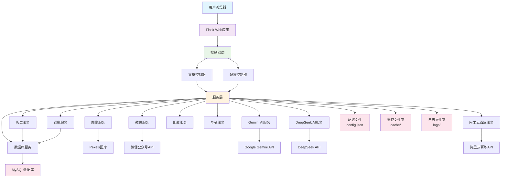

> 🚀 一站式AI写作、智能配图、极致排版、自动发布，助力新媒体人高效运营公众号！


## ✨ 项目亮点

- **多模型支持**：Gemini、DeepSeek、阿里云百炼等主流大模型一键切换
- **智能配图**：Pexels图库/AI生图，自动适配微信防盗链
- **极致排版**：自动内联样式，完美适配微信，支持多主题模板
- **草稿/历史/一键发布**：全流程自动化，支持草稿管理与历史追溯
- **本地/云端/容器化部署**：支持Windows、Mac、Docker一键部署
- **开放API**：可对接uniapp等前端，支持二次开发

---

## 🚀 功能总览

### 🌟 一站式AI内容创作与自动发布

- **多平台热点采集与智能选题**
  - 支持抖音、快手、B站、微博、X（推特）、TikTok、YouTube、知乎等主流平台，一键抓取行业最新热点。
  - 自动分析平台热榜，结合行业趋势，AI智能生成爆款标题，助力内容精准选题。
    

- **多模型AI写作引擎**
  - 集成 Gemini、DeepSeek、阿里云百炼等顶级大模型，随心切换，满足不同风格与场景需求。
  - 高级 Prompt 工程，深度定制公众号内容生成，支持自定义模板、字数、风格等参数。

- **智能配图与极致排版**
  - 支持 Pexels 图库、AI生图，自动适配微信防盗链，图片风格可选，视觉效果专业。
  - 内置多套精美排版模板，自动内联样式，完美适配微信 Webview，提升阅读体验。
    

- **全流程自动化：草稿、历史、定时、一键发布**
  - 草稿管理、历史追溯、定时发布、自动推送，极致提升内容生产与运营效率。
  - 支持一键发布到微信公众号，自动处理图片上传、封面生成、摘要提取等繁琐环节。

- **可视化配置与前端交互**
  - 前端支持多平台、多行业选择，支持自定义行业输入，所见即所得。
  - 配置管理、模型测试、历史记录、内容预览等一应俱全，操作简单易用。

- **开放API与二次开发友好**
  - 完善的接口设计，支持对接 uniapp、小程序、第三方平台，灵活扩展。
  - 代码结构清晰，便于二次开发和个性化定制。

- **安全合规与多端部署**
  - 支持本地、云端、Docker一键部署，兼容 Windows/Mac/Linux。
  - 重要信息本地存储，支持多平台API Key灵活配置，保障数据安全。

---

## 🏆 为什么选择 AITurbo？

- **极致自动化**：从选题、写作、配图到发布，全流程一键完成，释放你的内容生产力。
- **智能选题引擎**：行业+平台热榜智能分析，AI生成爆款标题，内容更有传播力。
- **多模型加持**：主流大模型随心切换，写作风格百变，满足不同内容需求。
- **专业排版与配图**：自动适配微信生态，图片、样式、模板一站式搞定。
- **开源免费，持续更新**：完全开源，永久免费，社区活跃，功能持续进化。
- **开发者友好**：接口开放，易于集成和二次开发，助力你的内容生态升级。

---

## 🛠️ 适用场景

- 自媒体人/内容创业者/企业新媒体团队
- 需要高频、批量、自动化生成和发布公众号内容的场景
- 需要AI辅助写作、智能配图、自动排版的内容生产者

---

## 🖥️ Windows 一键安装体验

无需 Python 环境，零配置一键安装！
已提供 Windows 平台专用的 exe 安装包，下载后双击即可完成部署，无需手动安装 Python、依赖或命令行操作。
安装完成后，桌面会自动生成启动快捷方式，点击即可直接打开 AITurbo 系统，极致便捷。
适合所有 Windows 用户，尤其是新媒体运营、内容创作者、企业团队等非技术人群。
安装步骤：
前往 Releases 页面 下载最新版安装包（.exe）。
双击运行，按提示完成安装。
桌面快捷方式启动，浏览器自动打开系统首页。
按照页面提示完成公众号、AI平台等配置，即可开始智能创作！


---


## ⚡ 快速体验

### 1. 本地开发模式【适用于第一版】
```bash
git clone https://github.com/lawrencezcl/AITubro.git
cd CodeStash
python -m venv venv
# Windows: venv\Scripts\activate
# Mac/Linux: source venv/bin/activate
pip install -r requirements.txt
python main.py
```
- 访问 [http://127.0.0.1:5000][公网ip]（需要将公网ip添加到自己公众号的ip白名单才可以）


### 2. 配置说明
- 复制 `config/config_template.json` 为 `config.json`，填写公众号、AI平台等信息
- 支持多模型API Key、作者信息、图片模型等灵活配置

---

## 🧩 主要配置项说明

| 配置项                | 说明                         |
|----------------------|------------------------------|
| wechat_appid         | 公众号AppID                  |
| wechat_appsecret     | 公众号AppSecret              |
| gemini_api_key       | Gemini API Key               |
| deepseek_api_key     | DeepSeek API Key             |
| dashscope_api_key    | 阿里云百炼API Key            |
| pexels_api_key       | Pexels图库API Key            |
| author               | 文章作者名                   |
| image_model          | 配图模型（gemini/pexels等）  |
| db_host              | MySQL数据库主机地址          |
| db_port              | MySQL数据库端口              |
| db_user              | MySQL数据库用户名            |
| db_password          | MySQL数据库密码              |
| db_name              | MySQL数据库名称              |
| ...                  | 更多详见 config.json         |

---

## 🗄️ MySQL数据库支持

本项目现在支持使用MySQL数据库存储历史记录和定时任务信息，以提供更好的数据持久性和查询性能。

### 数据库配置

在 `config.json` 文件中添加以下配置项：

```json
{
  "db_host": "localhost",
  "db_port": "3306",
  "db_user": "aiturbo_user",
  "db_password": "your_password",
  "db_name": "aiturbo"
}
```

### 数据库初始化

1. 确保已安装MySQL服务器
2. 运行数据库初始化脚本：

```bash
python init_database.py
```

该脚本将：
- 创建数据库（如果不存在）
- 创建必要的数据表
- 创建数据库用户并授权

### 数据迁移

如果之前使用文件存储的历史记录，可以运行数据迁移脚本：

```bash
python migrate_data.py
```

该脚本将把现有的JSON文件数据迁移到MySQL数据库中。

---

## 🐳 Docker Compose 部署

本项目支持使用 Docker Compose 进行容器化部署，简化部署流程并提高环境一致性。

### 部署步骤

1. 克隆项目代码：
```bash
git clone https://github.com/lawrencezcl/AITubro.git
cd AITurbo
```

2. 配置环境变量：
```bash
cp .env.example .env
# 编辑 .env 文件填写配置信息
```

3. 构建并启动服务：
```bash
docker-compose up -d
```

4. 访问应用：
```
http://localhost:5000
```

### 优势

- **环境隔离**：应用和数据库运行在独立容器中
- **一键部署**：通过 docker-compose 命令快速部署
- **数据持久化**：数据库数据和应用数据持久化存储
- **易于扩展**：可轻松添加更多服务或调整资源配置
- **跨平台**：支持 Windows、Mac、Linux 等多种操作系统

详细部署说明请参考 [DOCKER_DEPLOYMENT.md](DOCKER_DEPLOYMENT.md) 文件。

---

## 🏗️ 系统架构



---

## 💡 常见问题

- **图片防盗链/不显示？**  
  已内置图片代理和微信图片上传，公众号内外均可正常显示。
- **AI接口报错？**  
  检查API Key、网络，或切换备用模型。
- **草稿/发布失败？**  
  检查公众号配置、图片素材、封面图片是否有效。
- **IP白名单/接口权限？**  
  需将服务器公网IP加入公众号后台白名单。

---
